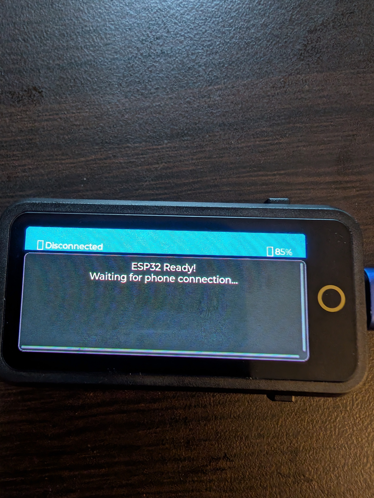
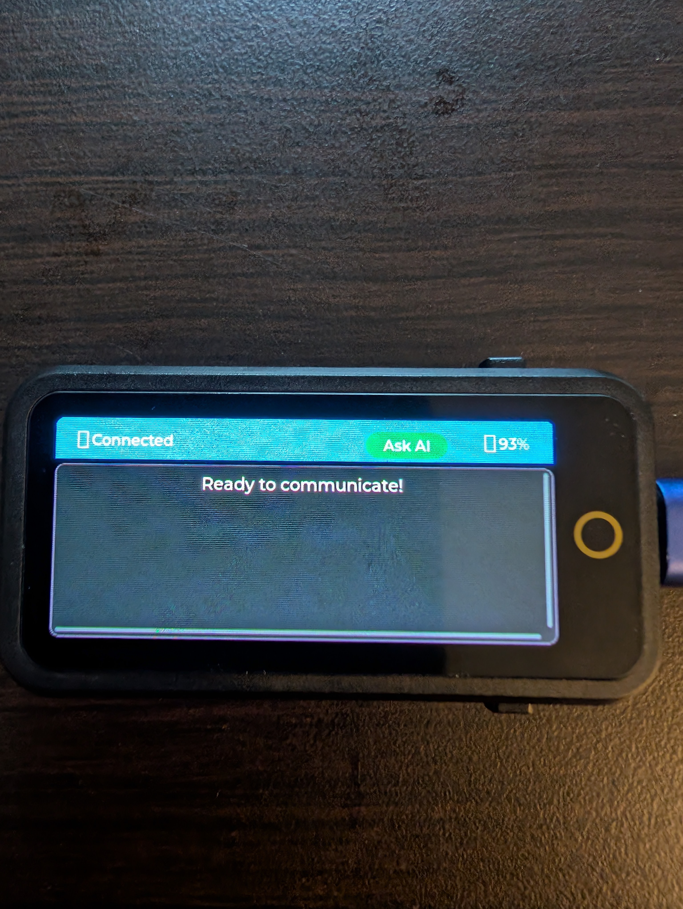
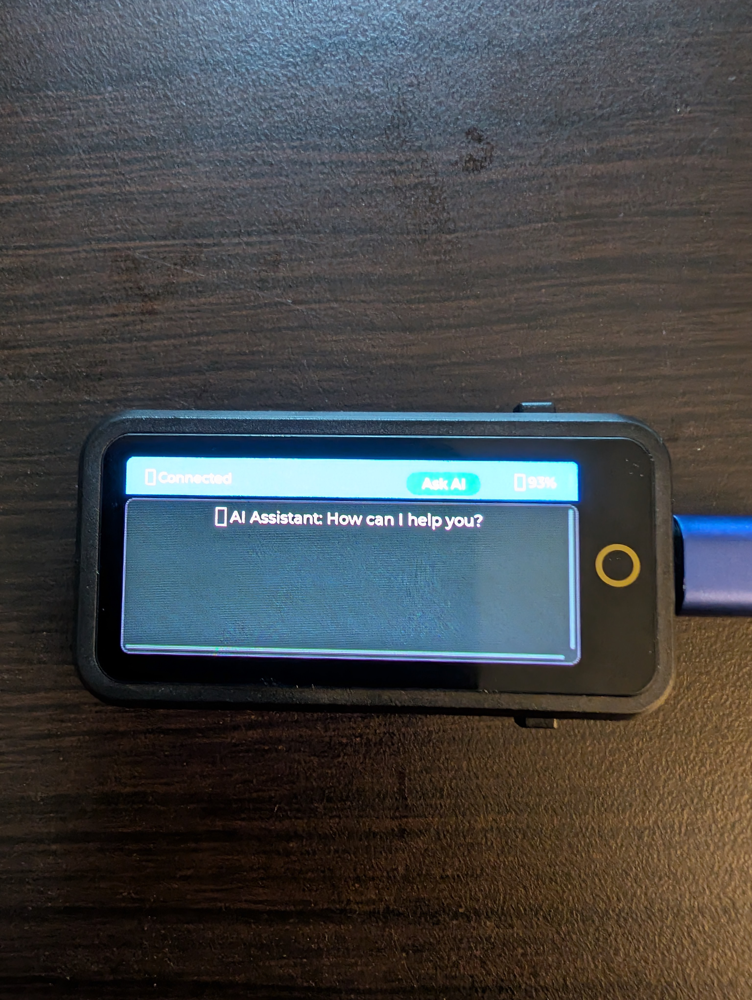
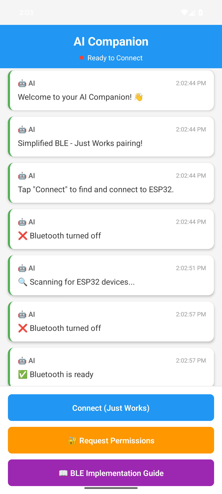
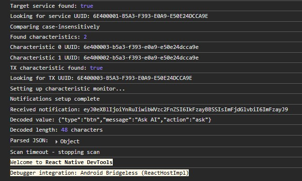

# ESP32 Touch Device - BLE Communication System

A proof-of-concept touch interface device using ESP32 T-Display AMOLED that communicates with a React Native mobile app via Bluetooth Low Energy.

## 🎯 Project Overview

This project demonstrates BLE communication between two devices:

1. **ESP32 T-Display AMOLED Device** - Touch interface with LVGL 9.3.0 UI
2. **React Native Mobile App** - Android app with Bluetooth Low Energy connectivity

## 📁 Project Structure

```
esp-to-phone/
├── firmware/                   # ESP32 T-Display AMOLED firmware
│   ├── boards/
│   │   └── T-Display-AMOLED.json # Board definition
│   ├── src/
│   │   └── main.cpp           # Main ESP32 application
│   ├── include/
│   │   └── lv_conf.h          # LVGL 9.3.0 configuration
│   ├── platformio.ini         # PlatformIO configuration
│   └── Makefile              # Build automation
└── mobile-app/
    └── AICompanionApp/        # React Native application
        ├── App.tsx           # Main app with Bluetooth functionality
        ├── android/          # Android-specific configuration
        └── package.json      # Dependencies and scripts


```

## 📹 Demo Videos

Watch the complete build and demonstration process:

### ESP32 Firmware Build & Upload Process
📺 **[ESP32 Build & Upload Demo](https://drive.google.com/file/d/1tfCH_RfHY0vfRteDODtnLQhBAn18tVjw/view?usp=sharing)**
- Complete firmware compilation with PlatformIO
- USB connection and device upload process
- Real-time build output and success verification

### Android App Build & BLE Communication
📱 **[React Native App & BLE Demo](https://drive.google.com/file/d/14VqLiNZARf0lIsb_HLVTyGlHeWoxKfY-/view?usp=sharing)**
- React Native app compilation and Android deployment
- Live Bluetooth scanning and ESP32 device connection
- Real-time bidirectional message exchange demonstration

> **Note**: These demonstration videos (42MB each) show the complete development workflow and real-time communication between the ESP32 device and Android application.

## ✨ Features

### ESP32 Device Features
- **LVGL 9.3.0 UI** with touch-responsive buttons
- **Bluetooth communication** for phone connectivity
- **Message display system** with queue management
- **Status indicators** for connection and battery
- **Touch interface** with three action buttons
- **Modern C++20** codebase with clean architecture

### Mobile App Features
- **Bluetooth connectivity** with ESP32 device scanning
- **Real-time messaging** between phone and device
- **Expandable message view** for detailed interactions
- **Connection status monitoring** with visual indicators
- **AI response simulation** based on device interactions
- **Modern React Native UI** optimized for Android

## 🚀 Quick Start

### ESP32 Firmware Setup

1. **Navigate to firmware directory:**
   ```bash
   cd firmware
   ```

2. **Build and upload:**
   ```bash
   make build        # Build the firmware
   make upload       # Upload to ESP32
   make monitor      # Start serial monitor
   ```

3. **Or use the quick deploy:**
   ```bash
   make deploy       # Clean, build, upload, and monitor
   ```

### Mobile App Setup

1. **Navigate to mobile app directory:**
   ```bash
   cd mobile-app/AICompanionApp
   ```

2. **Install dependencies:**
   ```bash
   npm install
   ```

3. **Run on Android:**
   ```bash
   npx react-native run-android
   ```

## 🔒 Security Considerations

### Current Security Features
- **Custom Service UUIDs**: Uses unique identifiers instead of standard Nordic UART service
- **Just Works Pairing**: Simple, secure connection establishment
- **Connection Logging**: Tracks client device addresses for monitoring
- **MTU Negotiation**: Negotiates optimal packet sizes securely

### Security Limitations
- **No Encryption**: Messages are sent in plain text (consider adding encryption for sensitive data)
- **No Authentication**: Any BLE-capable device can attempt connection
- **Broadcast Discovery**: Service UUIDs are visible during device scanning
- **Single Connection**: Only one device can connect at a time

### Privacy Protection
- **Device Address Logging**: Connected device addresses are logged for monitoring
- **Connection Filtering**: Future updates can add device whitelisting
- **Custom UUIDs**: Makes device discovery less obvious to generic BLE scanners

---

## 🔐 BLE Security & Device Management Roadmap

**Current Status**: Basic BLE communication (proof of concept)  
**Security Level**: Development/Demo (not production-ready)

### Next Steps for Production Deployment:
- **Phase 1**: Implement BLE bonding and encryption
- **Phase 2**: Add device authentication and pairing management  
- **Phase 3**: Multi-device support with secure device registry
- **Phase 4**: Connection attempt monitoring and security logging

## 🔗 Communication Protocol

The devices communicate via **Bluetooth Low Energy (BLE)** using JSON messages with **MTU negotiation** for larger payloads:

### Device to Phone Messages (ESP32 → App)
```json
{
  "type": "btn",
  "message": "Ask AI",
  "action": "ask"
}
```

### Phone to Device Messages (App → ESP32)
```json
{
  "type": "test",
  "message": "Hello from React Native app!",
  "action": "test_message"
}
```

## 🎮 User Interaction Flow

1. **Connection**: Phone app automatically scans and connects to ESP32 device via BLE
2. **Device Interaction**: User presses "Ask AI" button on ESP32 touch interface
3. **Message Transmission**: Device sends button press data to phone app
4. **AI Response**: Phone generates contextual AI response
5. **Display Update**: Device receives and displays AI message
6. **Real-time Communication**: Bidirectional JSON message exchange

## 🛠️ Technical Details

### ESP32 Firmware
- **Platform**: ESP32 with T-Display AMOLED
- **Framework**: Arduino with PlatformIO
- **UI Library**: LVGL 9.3.0
- **Communication**: Bluetooth Low Energy (BLE) with MTU negotiation
- **Language**: C++20 (GNU++2a)

### Mobile App
- **Platform**: React Native (Android)
- **Language**: TypeScript
- **Bluetooth**: react-native-bluetooth-serial
- **UI**: Modern React Native components
- **Target**: Google Pixel 8 Pro

## 🔋 Hardware Requirements

### ESP32 T-Display AMOLED
- ESP32-S3 microcontroller
- 1.91" AMOLED display (536×240)
- Capacitive touch interface
- Bluetooth connectivity
- USB-C charging
- Battery support

### Android Device
- Android 6.0+ (API level 23+)
- Bluetooth 4.0+
- Tested on Google Pixel 8 Pro

## 📱 App Screenshots & Device Interface

### Live Demonstration Images

#### ESP32 Device States

| Ready to Connect | Live Connection | Message Exchange |
|------------------|------------------|----------------|
|  |  |  |
| Device powered on and advertising | Real-time message display | Real-time communication |

#### Mobile App Interface

| Bluetooth Setup | Message Received | Technical Payload |
|-----------------|-----------------|-------------------|
|  |  |  |
| Ready to scan and connect | Live message from ESP32 | BLE JSON payload parsing |

#### Technical Proof of Concept

| BLE Protocol Success | JSON Message Parsing | Real-time Communication |
|---------------------|----------------------|-------------------------|
|  | 48-character JSON payload successfully parsed | Bidirectional ESP32 ↔ React Native communication |

### Device Features Shown
The ESP32 device features:
- **Status Bar**: Connection and battery indicators (🟢 Connected / 🔴 Disconnected)
- **Message Area**: Scrollable AI assistant messages with emoji indicators
- **Button Interface**: "Ask AI" button shown when connected
- **Touch Feedback**: Visual response to user interactions
- **Real-time Status**: Live connection state updates

### Mobile App Features Shown

The mobile app includes:

- **Connection Management**: Device scanning and pairing with permission handling
- **Message History**: Expandable conversation view with timestamps
- **Real-time Updates**: Live connection status with color-coded indicators  
- **Test Functions**: Debug communication features with BLE message exchange
- **Permission System**: Bluetooth and location permissions properly requested

## 🔧 Development

### Building Firmware

```bash
cd firmware
make clean-all    # Complete clean
make build        # Build firmware
make format       # Format code
make tidy         # Run linting
```

### Mobile App Development

```bash
cd mobile-app/AICompanionApp
npm run start     # Start Metro bundler
npm run android   # Run on Android device
```

## 📋 Requirements Fulfilled

✅ **Display Interface**: AMOLED screen with touch-responsive UI  
✅ **Touch Interface**: Three programmable action buttons  
✅ **Phone Communication**: Bluetooth messaging system  
✅ **Message Display**: Queue-based message management  
✅ **Interaction Flow**: Bidirectional communication  
✅ **Modern UI**: LVGL 9.3.0 with React Native app  
✅ **Demo Ready**: Complete working system with simulated AI responses

## 🔐 BLE Security & Device Management Roadmap

### Phase 1: Basic Security (High Priority)

- [ ] **Implement BLE Bonding**: Add persistent secure connections with encryption keys
- [ ] **Device Authentication**: Add PIN/passkey verification for initial pairing
- [ ] **Connection Encryption**: Enable BLE encryption for all data transmission
- [ ] **Custom Security Callbacks**: Implement security event handlers for ESP32

### Phase 2: Access Control (Medium Priority)

- [ ] **Device Whitelisting**: Create approved device list with MAC address filtering
- [ ] **Connection Rate Limiting**: Prevent brute force connection attempts
- [ ] **Automatic Reconnection**: Implement secure reconnection to bonded devices
- [ ] **Connection Timeouts**: Add configurable connection timeout and auto-disconnect

### Phase 3: Device Management (Medium Priority)

- [ ] **Bonded Device Storage**: Store bonded device information in ESP32 flash memory
- [ ] **Device Management UI**: Add UI in mobile app to view/manage bonded devices
- [ ] **Remove Bonded Device**: Implement unpairing functionality from both ESP32 and app
- [ ] **Device Nicknames**: Allow users to assign names to bonded devices

### Phase 4: Advanced Security (Low Priority)

- [ ] **Message Encryption**: Implement AES encryption for JSON payloads
- [ ] **Certificate-based Auth**: Add certificate validation for device authentication
- [ ] **OTA Security Updates**: Secure firmware update mechanism
- [ ] **Security Audit Logging**: Log all security events and connection attempts

### Phase 5: User Experience (Medium Priority)

- [ ] **Pairing Mode UI**: Visual indication when ESP32 is in pairing mode
- [ ] **Connection Status**: Real-time security status indicators
- [ ] **Security Settings**: User-configurable security options
- [ ] **Troubleshooting Guide**: Help users resolve pairing and security issues

## 🎯 Additional Feature Roadmap

### AI & Interaction Features

- [ ] Add more AI response templates with different personalities
- [ ] Implement gesture controls on ESP32 touchscreen
- [ ] Add notification system for AI responses
- [ ] Voice input/output capabilities

### Hardware & Monitoring

- [ ] Enhance battery monitoring with detailed statistics
- [ ] Add temperature/humidity sensors
- [ ] Implement power management features
- [ ] Add haptic feedback for interactions

### Development & Deployment

- [ ] Add OTA firmware updates with rollback capability
- [ ] Implement automated testing for BLE communication
- [ ] Add comprehensive logging and debugging tools
- [ ] Create deployment scripts for different environments

## 📚 Documentation Structure

- **README.md**: Main project documentation and setup guide
- **DEMO_GUIDE.md**: Complete demonstration walkthrough with examples
- **mobile-app/AICompanionApp/README.md**: Mobile app specific documentation

---

## 🎯 Proof of Concept Status

**✅ Ready for Demonstration**

This is a complete working proof of concept system featuring:

- **Real BLE Communication**: Fully functional Bluetooth Low Energy protocol
- **Production-Quality Code**: Clean, documented, and lint-error-free codebase
- **Visual Documentation**: Live demonstration images showing working system
- **User Experience Focus**: Polished UI/UX on both device and mobile app
- **Security Awareness**: Documented security considerations and improvement roadmap

The system demonstrates real-time BLE communication between ESP32 and Android device, making it ideal for showcasing touch interface and mobile connectivity concepts to stakeholders, investors, or development teams.

**Note**: This focuses on communication flow and user experience. AI backend integration can be added as the next development phase.

## Original Requirements

Touch Interface Communication Device
Design and implement a physical touch device (using Arduino/ESP32 or similar microcontroller with a small display) that communicates with a mobile application.

Requirements:
The device should have a screen that can display surface messages (e.g., short AI assistant prompts, notifications, or mock responses).

A touch interface (touchscreen or buttons) should allow the user to send actions/acknowledgments back.

A phone app (mobile or desktop mock) should:

Send mock data/messages to the device.

Receive interactions/taps from the device.
Show "expended view" of selected interactions
You don't need to implement a real AI backend — focus on communication flow and user experience. A demo of a few interactions is enough.